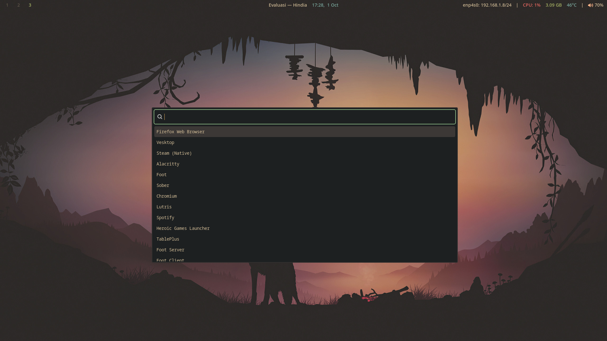
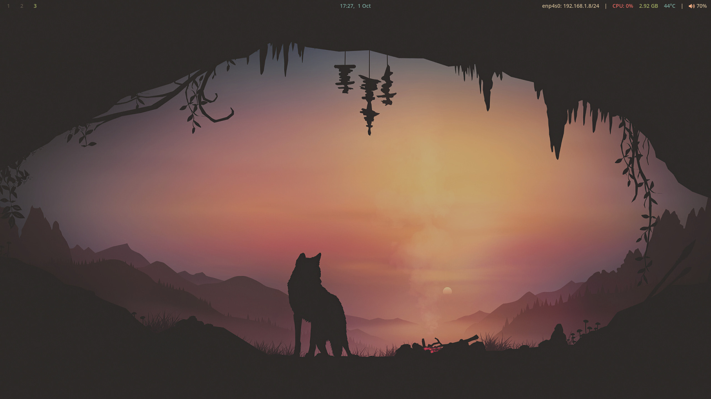

# Dotfiles

Personal dotfiles for keeping my Hyprland, Niri, and KDE installs in sync while staying window-manager agnostic by default. Shared configs live under `.config/`, while compositor-specific tweaks are isolated so they never leak across machines.

## Highlights
- Multi-environment aware: Hyprland and Niri overrides extend a common `.config` baseline, with legacy KDE bits parked under `kubuntu/`.
- Guided bootstrap: `./bin/setup.sh` handles backups, symlink creation, and optional per-environment overlays. Partial mode lets you re-run just the pieces you need.
- Gruvbox-friendly theming across terminals, Waybar, and GTK, with shared assets in `.local/`.
- Neovim powered by `lazy.nvim`, plus supporting CLI tooling surfaced through Fish, zellij, and terminal emulator configs.
- `./bin/update.sh` wraps the conventional `chore(dotfiles)` commit message so routine syncs stay consistent.

## Repository Layout
```
.
├── .config/              # Shared, WM-agnostic configs (fish, nvim, waybar, etc.)
├── .local/               # Wallpapers, themes, and helper binaries
├── bin/                  # setup.sh, update.sh, and other helper scripts
├── hyprland/.config/     # Hyprland overlays (hypr/*.conf, scripts, theme tweaks)
├── niri/.config/         # Niri config.kdl and matching GTK overrides
├── niri/.profile         # Thin wrapper sourcing the shared Wayland profile
├── profiles/wayland/     # Shared login profile fragments
├── kubuntu/              # KDE/Plasma specific keepsakes
├── fresh-install-guide.md  # Long-form notes for rebuilding a machine
└── screenshots/          # Reference captures used in the README
```

Follow the repo guidelines when editing—Hyprland changes belong in `hyprland/config/*.conf`, Niri adjustments in `niri/config.kdl`, shared tweaks under `.config/`, and Wayland session env vars inside `profiles/wayland/`.

## Getting Started
1. Clone the repo:
   ```bash
   git clone git@github.com:zlnew/dotfiles.git ~/dotfiles
   ```
2. Run the setup assistant and pick between full or partial install:
   ```bash
   cd ~/dotfiles
   ./bin/setup.sh
   ```
   The script creates symlinks, backs up conflicting files to `~/.dotfiles_backup/`, and optionally applies Hyprland or Niri overlays. When validating one area, choose “Partial setup” and enable only the pieces you want to refresh.

## Keeping Things Updated
- After local tweaks, re-run `./bin/setup.sh` (partial mode is ideal) to ensure the target files are linked and backups are stored.
- Use `./bin/update.sh` to stage, commit, and push the current state with the standard `chore(dotfiles)` message.
- Longer setup walkthroughs and package notes live in `fresh-install-guide.md`.

## Validation Checklist
- Run `./bin/setup.sh` inside a throwaway directory to confirm symlinks resolve cleanly.
- For Hyprland edits, reload with `hyprctl reload`.
- For Niri changes, validate first with `niri --validate ~/.config/niri/config.kdl`, then apply via `niri msg reload-config`.
- For Fish updates, sanity-check startup with `env XDG_CONFIG_HOME=/tmp/test-config fish --init-command 'exit'`.

## Screenshots
- 
- 
- 
